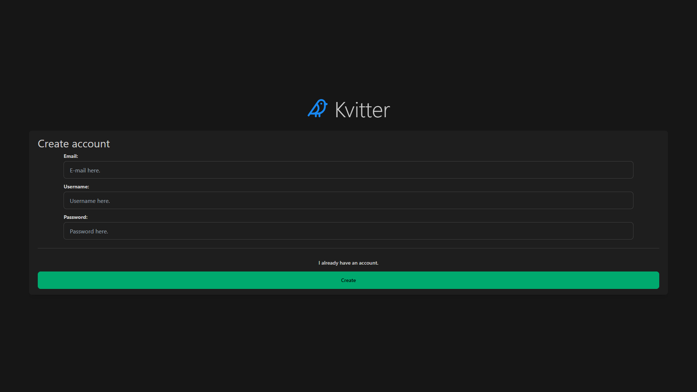
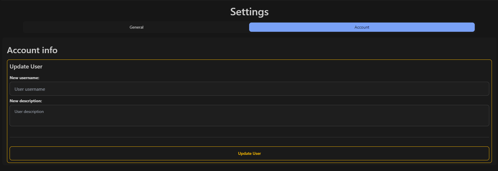
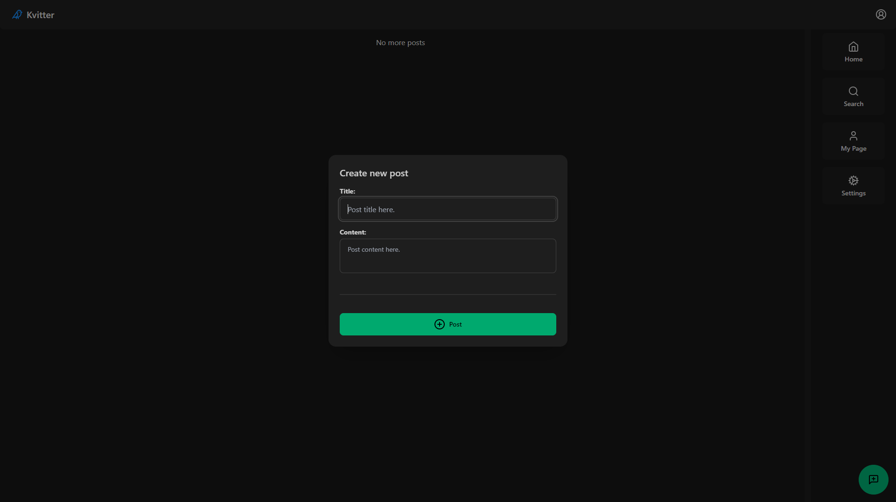
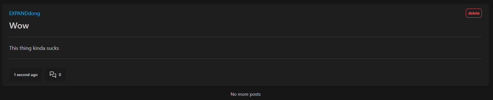
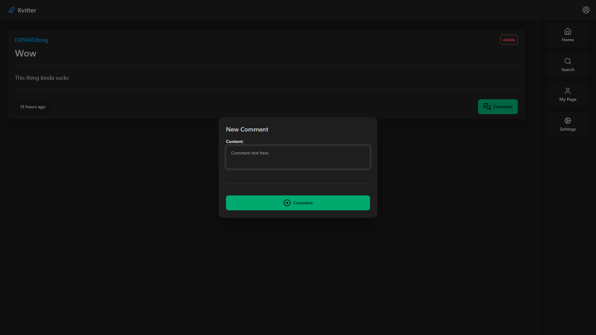
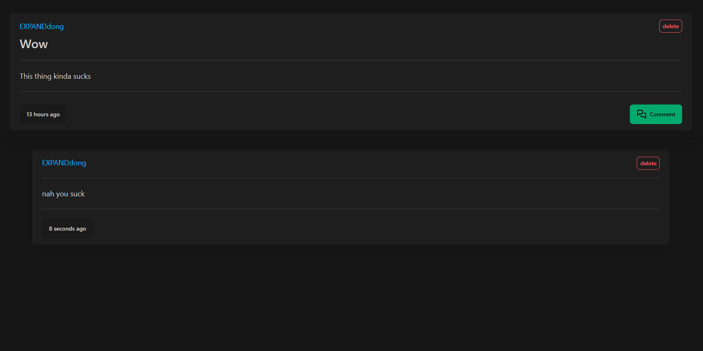
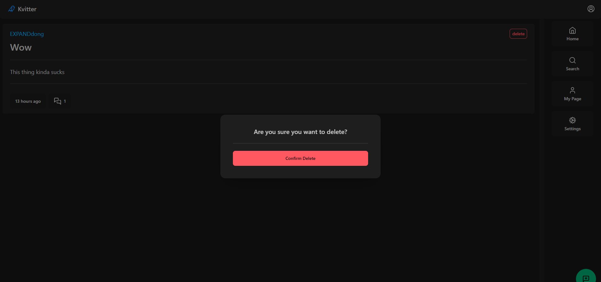
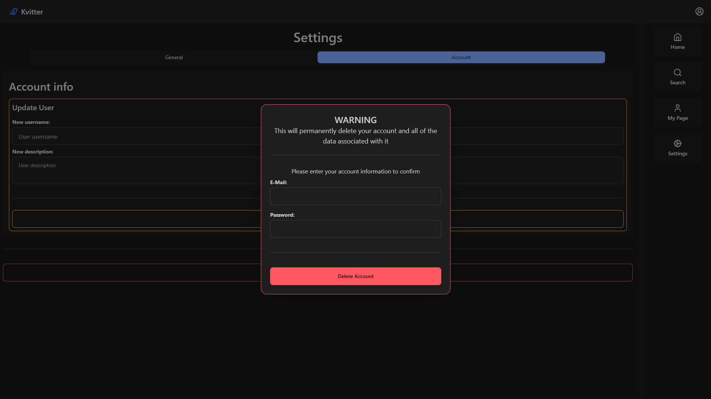

  Kvitter user guide ☝🤓
======

### Are you retarded?

### Do you need somebody to tell you how to do even the simplest of tasks?

### Then this is the guide for you!

---

In this user guide i will tell you the simple steps to using Kvitter.  
From creating your account to deleting it.

## Table of contents

- [Table of contents](#table-of-contents)
- [Creating your account](#creating-your-account)
- [Updating your description](#updating-your-description)
- [Creating your first post](#creating-your-first-post)
  - [And voilà!](#and-voilà)
- [Commenting on a post](#commenting-on-a-post)
- [Deleting your first post](#deleting-your-first-post)
- [Deleting your account](#deleting-your-account)

## Creating your account
We will start by creating an account.  
Simply input an email, your desired username, and a password.

> Make sure your username is between 4 and 36 characters long and only using alphanumerics.  
> The password should also be at least 8 characters long.
## Updating your description
After you have created your account, you might want to change your user description,  
Which will be "User Description" by default.  
To do this you will  have to go to settingsand into the account tab.

> If a field is left empty that will not be updated upon submission.

## Creating your first post
Now that your profile looks slightly less terrible, we can get to making your first post!  
To do this you simply press the green button in the bottom right corner and type away.

### And voilà!

> Screw you
## Commenting on a post
See a post you want to engage with or reply to?  
Well youre in luck because kvitter just so happens to have comments!  
  
Just open the post, press comment, and go nuts.

  

  

## Deleting your first post
Did you realize how retarded your first post was and want to get rid of it?  
Well lucky you, huh?  
  

> Finally the world is rid of that abomination

## Deleting your account
While youre at it, why dont you delete your account too?  
Its not like you're needed on here anyway.  
  
Just hop on over to account settings again and you will find what you need.
  

> Farewell, you absolute clown 🤡